# From SGEMM to fused attention: CUDA kernels from scratch

Three parts, one codebase, on a laptop RTX 5070 (Blackwell, sm_120). Parts 1 and
2 are FP32 on CUDA cores; part 3 moves both kernels onto FP16 tensor cores. No
libraries inside the kernels and no inline PTX in them (the peak-throughput
microbenchmark in part 3 is the one place that uses PTX `mma`).

1. **SGEMM** — single-precision matrix multiply `C = A·B`, written one
   optimisation at a time and measured against cuBLAS at every step. The final
   kernel reaches **85–88% of cuBLAS at 4096³** and **82–96% across five
   shapes**.
2. **Fused attention** — `O = softmax(Q·Kᵀ/√d)·V` built first from the SGEMM
   and a hand-written softmax kernel, then as a single FlashAttention-style
   kernel (online softmax, Br×Bc tiling, warp-shuffle row reductions). The fused
   kernel is **1.7–2.5× faster than an unfused cuBLAS pipeline for N ≥ 4096**,
   uses **no workspace**, and runs at **N = 65,536, where the unfused version
   needs 16 GB** for the score matrix.
3. **Tensor cores** — both kernels rewritten with FP16 WMMA fragments. The GEMM
   reaches **79–89% of cuBLAS FP16** (2.6× the FP32 ladder's best kernel); the
   fused attention kernel is **1.6–1.9× faster than its FP32 version** at an
   error of 4e-4. A peak-throughput microbenchmark explains the choice of
   format: on this GPU, **TF32 tensor cores are no faster than FP32 CUDA
   cores** (25 TFLOP/s each) — FP16 is the first format that doubles it.

The interesting parts are not the final numbers. They are the optimisations that
*didn't* work as predicted and why, the races and indexing bugs the test harnesses
caught that a single-size test would have missed, a 27% regression traced to the
compiler's code generation, and the timing method that had to be fixed twice
before 3% effects were measurable on a GPU that throttles.

**SGEMM ladder, 4096³:**

```
kernel                    time (ms)      GFLOP/s   % of cuBLAS   spread
----------------------  -----------  -----------  ------------  -------
naive                       103.269      1330.89          9.3%     9.1%
sharedmem                    72.543      1894.57         13.2%     7.4%
threadtile                   27.589      4981.71         34.8%     6.8%
sharedthread                 19.868      6917.76         48.4%     4.6%
sharedthreadv2               18.077      7602.83         53.2%     8.8%
transpose                    12.973     10593.92         74.1%     6.4%
doublebuffer                 12.126     11334.40         79.3%     6.2%
bk16                         11.034     12455.79         87.1%     5.6%
warptile                     10.893     12616.78         88.2%     9.7%
cuBLAS SGEMM                  9.611     14300.21        100.0%     7.4%
```
*N = K = M = 4096, fp32, median of 9 interleaved rounds. `spread` is
(max − min) / median across rounds — differences between kernels smaller than
their spread are not resolved.*

**Attention, batch 1, d = 64** (ms; workspace = scratch memory beyond Q, K, V, O):

```
     N   cublas-naive          naive (own GEMM+softmax)   online (fused)       fused vs
            ms  workspace          ms  workspace            ms  workspace   cublas-naive
  1024    0.07       4 MB        0.18       4 MB           0.11         0      0.64x
  2048    0.19      16 MB        0.53      16 MB           0.23         0      0.83x
  4096    1.18      64 MB        1.56      65 MB           0.71         0      1.66x
  8192    4.90     256 MB        5.82     258 MB           2.83         0      1.73x
 16384   21.15     1.0 GB       23.71     1.0 GB          11.48         0      1.84x
 32768  105.25     4.0 GB     launch err  4.0 GB          42.66         0      2.47x
 65536   > VRAM   16.0 GB      > VRAM    16.0 GB         164.11         0        -
```
*Median of 7 interleaved rounds; every point spot-checked (64 rows) against a
CPU fp64 reference. The fused kernel runs at 6.0–6.7 TFLOP/s for N ≥ 4096 (4·N²·d flops
per head).*

## Contents

**Part 1 — SGEMM**
- [Results across shapes](#results-across-shapes)
- [The ladder](#the-ladder)
- [What didn't work, and why](#what-didnt-work-and-why)
- [Correctness (SGEMM)](#correctness-sgemm)

**Part 2 — Fused attention**
- [Attention: three implementations](#attention-three-implementations)
- [The fused kernel](#the-fused-kernel)
- [Attention optimisation steps](#attention-optimisation-steps)
- [What the attention work taught](#what-the-attention-work-taught)
- [Correctness (attention)](#correctness-attention)

**Part 3 — Tensor cores**
- [Why FP16: peak throughput per format](#why-fp16-peak-throughput-per-format)
- [What changes in a tensor-core kernel](#what-changes-in-a-tensor-core-kernel)
- [tc_gemm: FP16 GEMM](#tc_gemm-fp16-gemm)
- [tc_attn: FP16 fused attention](#tc_attn-fp16-fused-attention)
- [Correctness (tensor cores)](#correctness-tensor-cores)

**All parts**
- [Measuring on a laptop](#measuring-on-a-laptop)
- [Build and run](#build-and-run)
- [Files](#files)
- [What's not here](#whats-not-here)

---

# Part 1 — SGEMM

## Results across shapes

A single shape is a single data point. 4096³ is a friendly one — every
dimension is a multiple of the 128-wide tile, so no tile is ever partial, and
the 1024 blocks fill the GPU 14 waves deep. `make sweep` reports the same
ladder at five shapes chosen to break those assumptions:

```
kernel            4096x4096x4096  2048x2048x2048  4000x4000x4000  1024x4096x1024   8192x512x8192
naive                       9.2%            9.9%           10.7%           10.1%            9.5%
sharedmem                  12.8%           14.0%           15.0%           14.5%           14.0%
threadtile                 33.8%           35.2%           38.5%           32.3%           34.7%
sharedthread               46.7%           51.8%           55.0%           48.8%           49.4%
sharedthreadv2             51.9%           55.5%           61.2%           53.4%           56.1%
transpose                  75.5%           76.0%           83.5%           77.3%           74.6%
doublebuffer               76.0%           74.7%           88.1%           81.0%           75.2%
bk16                       83.5%           80.6%           93.6%           86.6%           79.7%
warptile                   85.0%           82.9%           96.5%           89.2%           81.7%

  4096x4096x4096  baseline, all tiles full
  2048x2048x2048  256 blocks: 3.6 waves, big tail
  4000x4000x4000  ragged: last tile row/col 25% used
  1024x4096x1024  long K, only 64 blocks (< 1 wave)
  8192x512x8192   short K, huge C: prologue/epilogue dominate
```

The ordering of the rungs holds at every shape. Two columns are worth a note:

- **4000³ is the best ratio at 96.5%** — not because the kernel likes ragged
  edges (it wastes a quarter of the last tile row and column), but because
  cuBLAS handles off-power-of-two shapes *worse* than it handles 4096³. The
  ratio rises because the denominator fell.
- **1024×4096×1024 launches only 64 blocks** against 72 resident slots — the
  shape where cuBLAS almost certainly uses split-K to fill the machine and this
  kernel doesn't. 89% without that trick is the clearest remaining lever.

The two 4096³ columns above (88.2% and 85.0%) come from different runs. That
3-point gap is thermal: see [Measuring on a laptop](#measuring-on-a-laptop).

## The ladder

Each rung is one file and one idea. Nothing is shared between files, so any of
them compiles and runs standalone.

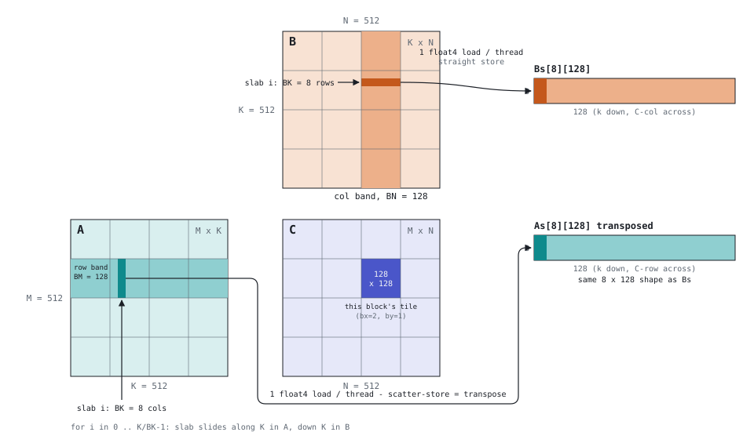

| # | file | change | regs | smem | blocks/SM | % cuBLAS |
|---|---|---|---|---|---|---|
| 1 | `naive.cu` | one thread per output, coalesced mapping | 32 | — | — | 9.3 |
| 2 | `sharedmemtile.cu` | 16×16 shared-memory tiles | 38 | 2 KB | — | 13.2 |
| 3 | `threadtiling.cu` | each thread computes 4×4 outputs (no shared) | 48 | — | — | 34.8 |
| 4 | `sharedthreadtile.cu` | 4×4 register tile on a 64×64×64 shared tile | 55 | 32 KB | 3 | 48.4 |
| 5 | `sharedthreadtilev2.cu` | 8×8 register tile, 128×128×8 block tile, 256 threads | 96 | 8 KB | 2 | 53.2 |
| 6 | `transpose.cu` | `float4` global loads, As stored transposed | 90 | 8 KB | 2 | 74.1 |
| 7 | `doublebuffer.cu` | two shared buffers, prefetch next slab, one barrier per slab | 93 | 16 KB | 2 | 79.3 |
| 8 | `bk16.cu` | K-slab 8 → 16 | 118 | 32 KB | 2 | 87.1 |
| 9 | `warptiling.cu` | warp-level remap: each warp owns a 64×32 block of C, not a 16×128 strip | 118 | 32 KB | 2 | 88.2 |

**Rungs 1–5** are the standard reuse hierarchy: block tiles cut global traffic
by `BM·BN / (BM+BN)`, register tiles cut shared traffic by `TM·TN / (TM+TN)`.
The step to 8×8 register tiles on a 128×128 block tile is the single largest
architectural change: it drops occupancy from 50% to 33% (registers become the
limit) and gets faster anyway, because 64 independent FMAs per thread hide
latency better than extra warps do.

**Rung 6** replaces four scalar loads with one 128-bit load, and stores A's
slab *transposed* into shared memory so that a thread's 8 values from As are
contiguous. That makes As and Bs the same shape (8×128) and the compute loop
symmetric. The four scattered stores are the price; each stored element is
read 16 times, so it's paid once and collected repeatedly.

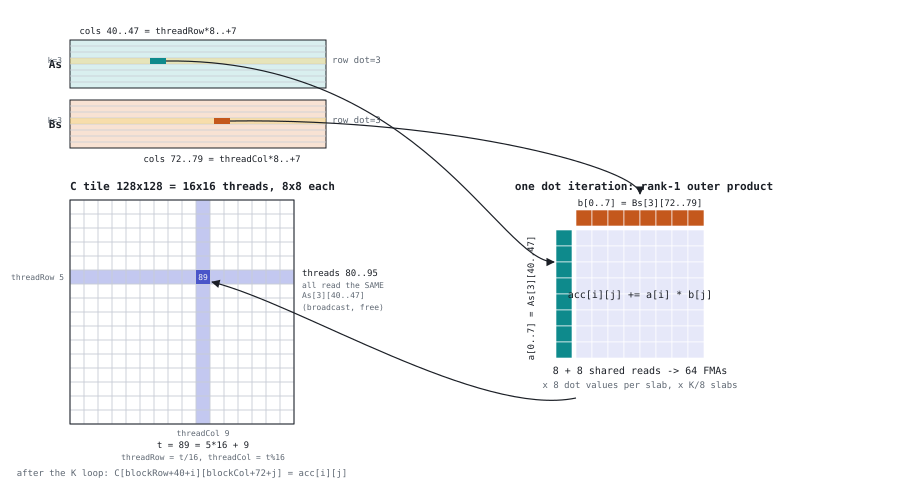

**Rung 7** issues the global load for slab i+1 before computing slab i, and
writes it into the *other* shared buffer, so the "done reading" barrier
disappears.

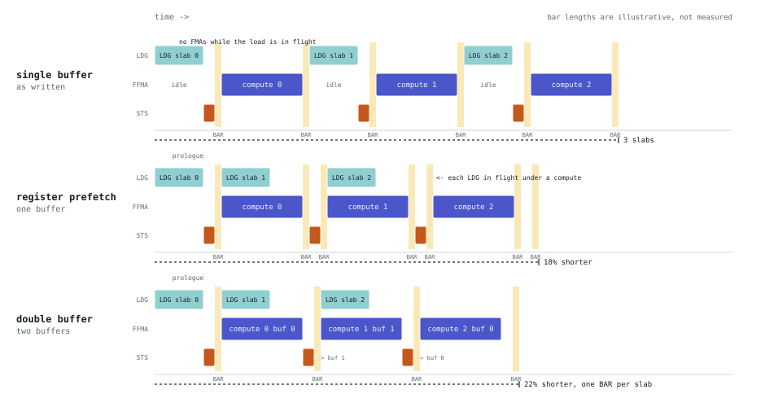

**Rung 8** doubles the slab depth. BK contributes nothing to reuse (it's not in
either formula above) — it amortises per-slab overhead, mainly the barrier, and
doubles the compute under which each prefetch hides. Going further is blocked
three ways at once: 64 KB static shared exceeds the 48 KB limit, would allow
only 1 block per SM, and needs 32 prefetch registers.

**Rung 9** changes which thread owns which 8×8 tile so that a warp's 32 lanes
cover a 64×32 block of C instead of a 16×128 strip. Per dot step the warp then
needs 96 distinct floats from shared memory instead of 144, and the 2-way bank
conflict on the Bs fragment read becomes a broadcast. Six lines; the loads and
the compute loop are untouched.

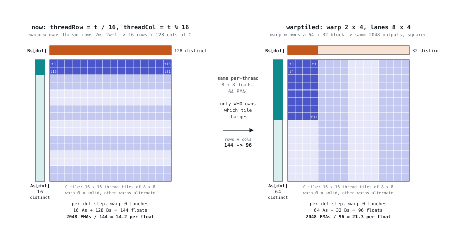

The remaining figures — the float4 loads (`fig2`, `fig3`), why one barrier
suffices with two buffers (`fig6`), and the bank-phase diagram (`fig8`) — are
in [`docs/`](docs/), generated by [`docs/gen_fig.py`](docs/gen_fig.py).

## What didn't work, and why

These are the rows I'd point to first.

**Barrier placement was worth 1.7×.** The first version of rung 5 had
`__syncthreads()` inside its load loops and inside the dot loop — 16 barriers
per slab instead of 2. At 512 slabs that's 8192 barriers. Moving them (no other
change) took the kernel from 32.6% to 55% of cuBLAS. Extra barriers are
over-synchronisation, so every correctness test passed; only the timing showed
it. The thin BK that makes the config good is exactly what multiplies any
per-slab overhead by 8×.

**Forcing higher occupancy made it slower.** `__launch_bounds__(256, 3)` took
rung 6 from 90 to 80 registers and 2 to 3 blocks per SM — and 8% slower, from
16 bytes of spills. The register budget was genuinely full.

**Double buffering gave 0% — because occupancy was already hiding the load.**
Rung 7 measured within noise of rung 6 at 2 blocks per SM. Forcing both to
1 block per SM (64 KB of unused dynamic shared memory), the single-buffer kernel
lost a third of its throughput and the double-buffered one lost 15%: a 31%
difference. With two blocks resident, when one stalls on its global load the
other is mid-compute; the scheduler was paying the latency with the other
block's work. Double buffering makes a block hide its *own* latency, which is
insurance against low occupancy, not a speedup on its own.

**Warptiling was +3%, not the ~10% the wavefront arithmetic predicted.** Paired
A/B, 40 alternating rounds, order swapped each pair, clock settled: median ratio
1.029, interquartile 0.978–1.083, faster in 25 of 40. Real but small. Either
Blackwell's shared-memory pipeline handles the 2-way conflict more cheaply than
the textbook model, or the kernel is limited by something warptiling doesn't
touch. Without a working profiler (see below) I can't say which.

**Padding As rows to kill a 4-way store-side bank conflict: +1.4%, 23 of 40.**
Noise. The transposed scatter-store hits four different addresses in the same
bank; padding the row to 132 floats halves that to 2-way (a full fix needs a
swizzle, since the stride must stay a multiple of 4 for `LDS.128` alignment).
It didn't matter.

**The compiler had already vectorised the shared reads.** The SASS for rung 6
shows `4 LDS.128 + 64 FFMA` per dot step — the "float4 shared loads" rung was
done by nvcc because it could prove alignment. Worth checking before writing.

## Correctness (SGEMM)

`test/test_sgemm.cu` includes every kernel file (with their `main` and wrapper
renamed away by macro) and checks each against cuBLAS on eight shapes:

```
shape  N x K x M      naive  sharedmem  threadtile  sharedthread  ...  warptile
  64 x  64 x  64        ok        ok          ok            ok            ok
 128 x 128 x 128        ok        ok          ok            ok            ok
 256 x 256 x 256        ok        ok          ok            ok            ok
 512 x 512 x 512        ok        ok          ok            ok            ok
 129 x 129 x 129        ok        ok          ok            ok    skip (K,M % 4)
 200 x 300 x 400        ok        ok          ok            ok            ok
  48 x  80 x  96        ok        ok          ok            ok            ok
1024 x1024 x1024        ok        ok          ok            ok            ok
```

Things the harness does that turned out to matter:

- **It tests itself first.** The comparator is fed a deliberately corrupted
  result and must fail; cuBLAS is checked against a double-precision CPU matmul
  (2.4e-7 relative). That second check also proves cuBLAS is running true fp32
  — TF32 tensor-core math would sit at ~1e-3 — so the "% of cuBLAS" comparison
  is like for like.
- **Shapes that aren't multiples of the tile.** `sharedthreadtile` was correct
  on every square size and wrong on 200×300×400; a size sweep is what caught it.
- **Output buffers are poisoned** (`0xAB`) before each run so an unwritten cell
  can't pass by luck.
- **It caught two races.** Rung 7's first version lacked a barrier after the
  prologue load: wrong on 1 of 10 runs at 512³, 10 of 10 at 1024³, never at
  64³ — warps happen to stay in lockstep on small problems. A race that passes
  at small sizes is still a race.
- **Alignment is a declared precondition.** The `float4` kernels need K and N
  divisible by 4 (a misaligned 128-bit load faults, and the error is sticky).
  The harness skips those cells rather than running them; a production wrapper
  would dispatch to the scalar kernel instead.

`ladder/tilecheck.py` checks a thread→tile load mapping on the CPU — every element
loaded exactly once, and how many 32-byte sectors a warp touches — before any
kernel is written. It's how BK = 16 was found to need a second load pass.

---

# Part 2 — Fused attention

## Attention: three implementations

Single-head attention, `Q, K, V, O` of shape `[batch][N][d]`, fp32:

```
O = softmax(Q·Kᵀ / √d) · V
```

The obvious implementation writes the `N × N` score matrix `S` to global
memory, softmaxes it in place, and multiplies it by `V`. That is two GEMMs and a
row-wise kernel, and `S` is the problem: at N = 65,536 it is 16 GB per head. The
three implementations in `test_attn.cu`:

| variant | file | what it is | workspace |
|---|---|---|---|
| `cublas-naive` | `test/test_attn.cu` | cuBLAS `S = Q·Kᵀ`, a softmax kernel, cuBLAS `O = S·V` | `N²` floats |
| `naive` | `attention/naive_attn.cu` | the same pipeline from this repo's parts: the warptiling SGEMM (`gemm.cuh`) and `softmax.cu` — four launches per head | `N² + N·d` floats |
| `online` | `attention/online_attn.cu` | one fused kernel; `S` never leaves the SM | 0 |

`cublas-naive` is the baseline the fused kernel is measured against: the best
you can do *without* fusion, using a vendor GEMM. `naive` is the same pipeline
built from the Part 1 kernels. It runs 12–32% behind `cublas-naive` for
N ≥ 4096 (more at small N), and it fails to launch at N = 32,768 because `softmax.cu` uses one
thread per 16 elements of a row and one block per row, so its block would need
2048 threads.

Past N = 4096 the fused kernel wins by a growing margin (1.7× → 2.5×): the
unfused versions' time is dominated by writing and re-reading `S`, which grows as
N², while the fused kernel's global traffic is only `Q, K, V, O` — plus K and V
re-read once per 64-row query tile. Below N = 4096 it loses, for a different
reason: it launches one block per 64 query rows, so N = 1024 is 16 blocks on a
36-SM GPU. Most of the machine is idle. Real workloads put batch × heads in the
grid, which fills it (see [What's not here](#whats-not-here)).

## The fused kernel

The algorithm is FlashAttention's forward pass: split the keys into chunks,
compute one chunk of scores at a time, and keep a **running max `m` and running
sum `l`** per query row. When a new chunk raises the max, everything
accumulated so far is too large by the same factor `exp(m_old − m_new)`, so
one multiply per row corrects both `l` and the output accumulator. Nothing is
ever revisited, and the final `O = o / l` is one divide per output.

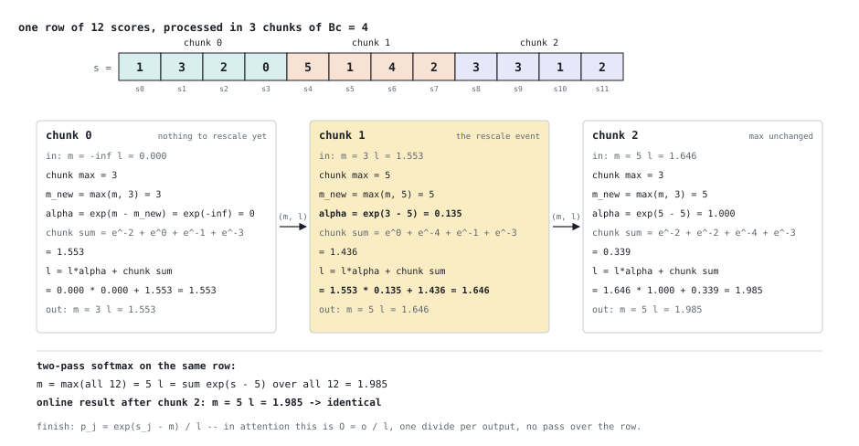

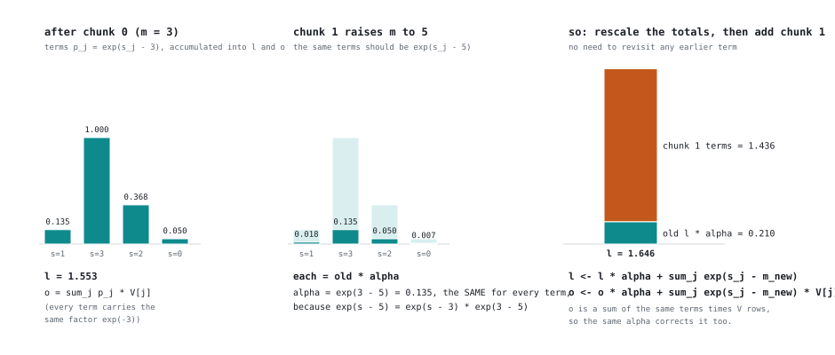

**Decomposition.** One block owns `Br = 64` query rows and streams K and V
through in chunks of `Bc = 32` keys. 128 threads = 4 warps; each warp owns 16
rows; within a warp, the 8 lanes with the same `lane / 8` share 4 rows. Per
chunk, each thread computes a 4×4 patch of `S` (4 rows × 4 keys) and
accumulates a 4×8 patch of `O` (4 rows × two groups of 4 of the 64 output
columns).

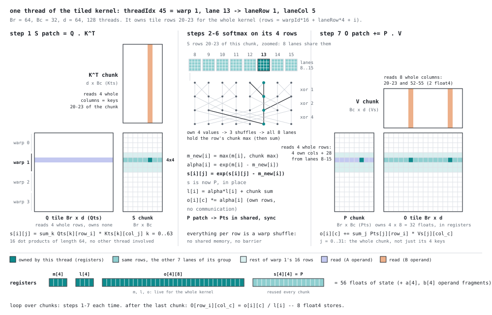

The layout choice that matters: **every row lives inside one warp**, in 8
consecutive lanes. The row max and row sum are then a 4-value local reduction
followed by three `__shfl_xor_sync` steps (xor 4, 2, 1 — which only ever flip
the low three lane bits, so they stay inside the 8-lane group). No shared
memory, no barrier for the softmax itself. And because a thread's `O` patch is
on the same rows as its `S` patch, the rescale by `alpha` is purely local.

Per chunk:

```
load K chunk (transposed) and V chunk into shared        __syncthreads
S patch = Q·Kᵀ         Q tile resident in shared, loaded once, pre-scaled
row max → m_new, alpha → P = exp2(S − m_new) → row sum → l, rescale o
                                                          __syncthreads   (K no longer read)
write P patch into shared, over the K buffer              __syncthreads   (all of P written)
o += P·V               each thread reads 4 full rows of P, 28 of 32 values from other lanes
                                                          __syncthreads   (buffers free)
```

The one place this fp32 kernel pays something a tensor-core version doesn't is
the **P round trip through shared memory**: a thread computed a 4×4 patch of P
but needs 4 *full* rows of it for `P·V`. FlashAttention-2 avoids it because the
`mma` accumulator fragment layout matches the next `mma`'s operand layout; a
hand-written outer product has no such luck.

Details that keep it correct for any N:

- **Ragged N**: out-of-range Q rows and K/V rows are zero-filled on load;
  out-of-range scores are set to `−∞` before the max, so `exp2(−∞) = 0`
  removes them from the max, the sum and `P·V`. (Zero-filling K alone is
  *not* enough — a zero key gives a score of 0, which is a real weight.)
  Zero-filling V keeps `0 × stale-NaN` out of the product.
- **`m` starts at `−FLT_MAX`, masked scores are `−∞`** — two different
  sentinels on purpose. `−∞` for both would turn a fully-masked chunk into
  `exp(−∞ − (−∞)) = NaN`.
- **No early exit.** Threads whose rows are past N still load, reach every
  barrier, and take part in every full-mask shuffle; only the final store is
  guarded.

Final resources: **95 registers, 32 KB static shared, 3 blocks (12 warps) per
SM, no spills.** Head dim is fixed at compile time (`D = 64` — GPT-2, BERT,
ViT); other head dims would be template instantiations, which is how production
attention libraries handle it.

## Attention optimisation steps

Measured the same way as Part 1: harness sweeps for large effects, paired
alternating A/B builds of the same file for anything small. Effects are changes
in run time; negative is faster.

| # | change | effect | how measured |
|---|---|---|---|
| 1 | tiled fused kernel (`d` a runtime argument) | 1.4–1.9× faster than `cublas-naive` for N ≥ 4096 | harness |
| 2 | ragged-N guards (zero-fill, `−∞` mask) | 0.1–0.5%, within noise: free | paired A/B |
| 3 | `d` → compile-time constant `D = 64` | **+27%** (slower) | paired A/B |
| 4 | explicit `float4` shared reads in both products | −19 to −27% (undoes #3) | harness |
| 5 | `P` aliases the `K` buffer: 40 → 32 KB, 2 → 3 blocks/SM, +1 barrier | +0.2 / −1.1 / −6.3 / −11.8% at N = 4K / 8K / 16K / 32K | paired A/B |
| 6 | `exp2f`, with `log2 e` folded into the Q scale | −2.6 to +0.8%: noise | paired A/B |

## What the attention work taught

**A compile-time constant cost 27%.** Replacing the runtime `d` with
`#define D 64` — which should only help — made the kernel 27% slower, with
identical results. The SASS showed why: with a runtime bound, nvcc had unrolled
the `S` loop by 4 and noticed that `Qs[row][h..h+3]` are contiguous, emitting
`8 LDS.128` per 64 FMAs. With the constant bound it chose a different unroll
and emitted `1 LDS.128 + 4 LDS.32` per 16 FMAs — 2.5× the shared-load
instructions, in a loop that is shared-load bound. `#pragma unroll 4` recovered
only half. Writing the `float4` loads explicitly (step 4) recovered all of it
and no longer depends on the unroller's mood. Same lesson as the last row of
Part 1's "what didn't work", from the other side: check the SASS.

**Occupancy only helps when there are waves to fill.** Aliasing `P` onto `K`'s
buffer let 3 blocks fit per SM instead of 2. At N = 4096 that changed nothing:
64 blocks already fit in 72 slots, so the third slot was never used. At
N = 32,768 (512 blocks, many waves) it was worth 12% — the extra warps cover
barrier and shared-load stalls, more than paying for the extra barrier.

**The exponential was never the bottleneck.** `expf` → `exp2f` is what
production kernels do, and it's kept, but it measured as noise. The SASS
explains it: `expf` already compiles to one `MUFU.EX2` plus about four FP32
instructions, and a thread issues 20 of them per chunk against ~2,000 FMAs.

**Bank conflicts that padding can't fix.** The `K` chunk is stored transposed
so the `S` loop can read 4 keys as one `float4`; the transposed store is an
8-way conflict (8 lanes, rows 8 apart, 256 floats apart). Any row padding that
breaks the conflict breaks `float4` alignment. It needs a remapped store or a
swizzle; with no profiler available it's unmeasured, and parked.

## Correctness (attention)

`test_attn.cu` checks every variant against a CPU double-precision reference
(full output up to N = 2048; for larger N, `cublas-naive` is the reference in the
correctness suite, and the sweep spot-checks 64 rows against the CPU at every
N — attention rows are independent, so 64 rows of a 65,536-long sequence cost
the same as a 64×65,536 problem). Shapes include d = 32 and 128, batch 2 and 3,
and ragged N = 1000 and 333. Worst fused-kernel error: 6e-6 relative.

`test_online.cu` is a debugging harness for the fused kernel, built before it
worked. It runs three stages, each designed so that a failure points at one
part of the kernel:

| stage | input | must produce | isolates |
|---|---|---|---|
| 1 | `V = 1` | exactly 1 everywhere, whatever the scores | `o` and `l` consistent; every output written |
| 2 | `Q = 0` | every row = column means of V | V load, `P·V`, store — with `S` taken out |
| 3 | random | CPU fp64 reference | everything |

On failure it prints a **tile map** — one character per 4×4 patch of the failing
64×64 output tile, rows labelled by (warp, laneRow), columns by laneCol — and
whether `got / ref` is a single constant along each wrong row. The three bugs it
found in the first version, and what each looked like:

- **Missing `/ l`**: stage 1 wrong everywhere, but `got/ref` constant along each
  row and growing with N (28 at N = 64, 1198 at N = 4096) — the output *was* `l`.
- **Load stride ≠ load width**: K/V loads used `laneCol * 4` as the start of 8
  columns. The map showed columns 36–63 wrong on every row: columns 4–31 were
  loaded twice and 36–63 never.
- **Tile loads sized for the wrong array**: the first load reused the compute
  mapping and wrote 64 rows into 32-row arrays. No fault — the extra rows
  landed in the neighbouring shared arrays (static shared was exactly 48 KB,
  the sum of the four).

Before the attention kernels, `softmax.cu` got its own unit test
(`test_softmax.cu`, one block per row, row lengths up to 4096, and scores up
to ±100 to exercise the max subtraction). It caught the classic one: warp-rounded
blocks have padding threads, and an unguarded store by those threads wrote into
the next row.

---

# Part 3 — Tensor cores

Both kernels, rewritten so the multiply-adds run on tensor cores through the
WMMA API (`nvcuda::wmma`): FP16 inputs, FP32 accumulation, inputs and outputs
still `float*` so the same harnesses and references apply.

## Why FP16: peak throughput per format

Which format to use was decided by measurement. `tensor_core/mma_peak.cu` issues
back-to-back multiply-adds with no memory traffic and enough independent
accumulators to hide latency — the ceiling any kernel could reach, per format:

| path | peak (range over runs) | vs FP32 |
|---|---|---|
| FP32 FFMA on CUDA cores (the Part 1 ladder) | 25.3–25.4 TFLOP/s | 1× |
| TF32 tensor cores (`wmma` 16×16×8, or `mma.sync` m16n8k8) | 24.1–25.2 | **1×** |
| FP16 in, FP32 accumulate (`mma.sync` m16n8k16) | 48.6–50.4 | 2× |
| FP8 e4m3 in, FP32 accumulate (`mma.sync` m16n8k32) | 95–101 | ~4× |

On this GeForce part, **TF32 tensor cores and plain FP32 cores have the same
ceiling**, so a TF32 kernel can at best match a good FP32 one; FP16 is the first
format that doubles it. (cuBLAS TF32 still beats cuBLAS FP32, 146%, because the
tensor path is easier to keep near its ceiling — not because the ceiling is
higher.) FP8 doubles it again but was not used: 3 mantissa bits means ~3% error
per input, it needs per-tensor or per-block scale factors to be usable, and
WMMA doesn't support it — it needs `mma.sync` with explicit register layouts.

## What changes in a tensor-core kernel

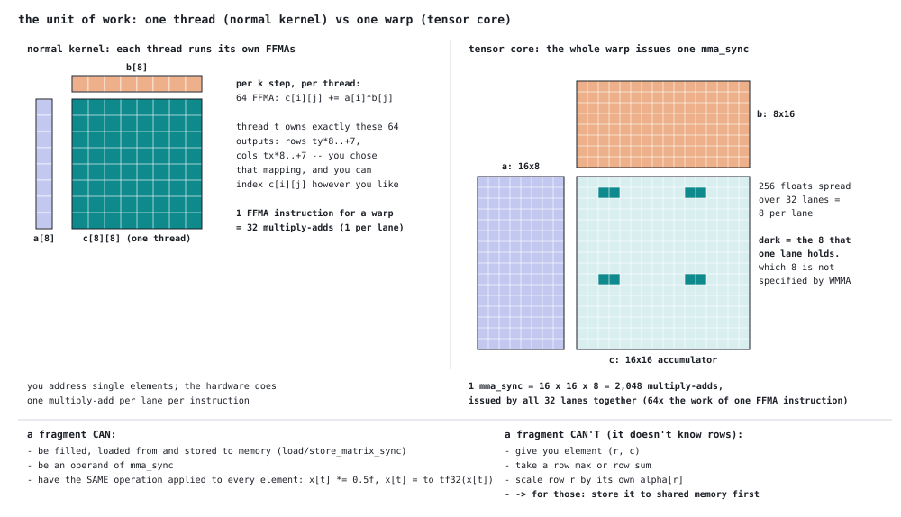

On CUDA cores each thread issues its own FFMAs on values it can index. A tensor
core is driven by the **whole warp**: all 32 lanes call `mma_sync` together and
the hardware computes a whole tile product in one call — 16×16×16 = 4,096
multiply-adds for FP16, against 32 for one FFMA instruction across a warp (the
figure shows the TF32 shape, 16×16×8). Operands and results live in
**fragments**: register tiles spread across the 32 lanes in a layout WMMA does
not specify. You can load, store, `mma`, or apply one operation to every
element — but you cannot ask for element (r, c), so anything per row (a row max,
scaling row r by `alpha[r]`) has to go through shared memory.

Everything else — block tiling, coalesced float4 global loads, shared tiles,
barriers, double buffering, occupancy — carries over unchanged. The warp's job
is literally the same: in the GEMM each warp still owns a 64×32 block of C;
only the split inside the warp changes, from 32 lanes × 8×8 to 8 fragments of
16×16, and 512 FFMA instructions per k-step become 8 `mma_sync`.

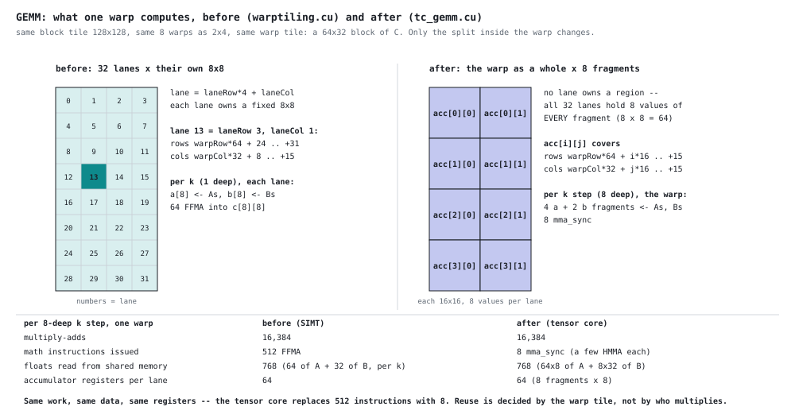

## tc_gemm: FP16 GEMM

`tensor_core/tc_gemm.cu` keeps rung 8's structure (128×128 block tile, 256
threads as 2×4 warps of 64×32, double-buffered shared memory, register-staged
prefetch) and replaces the per-thread 8×8 outer product with fragments:

- **Conversion on the way in:** the float4 global loads are converted to `half2`
  immediately, and shared memory holds `half` — half the bytes per tile.
- **BK = 32:** one FP16 `mma` is 16 deep, so BK = 16 would leave one step per
  slab. Two steps per barrier; the halved element size keeps both buffers at
  37 KB.
- **Padding 8, not 4:** for `half` fragments `ldm` must be a multiple of 8
  elements; tile starts must be 32-byte aligned.
- **`__launch_bounds__(256, 2)`:** see below.

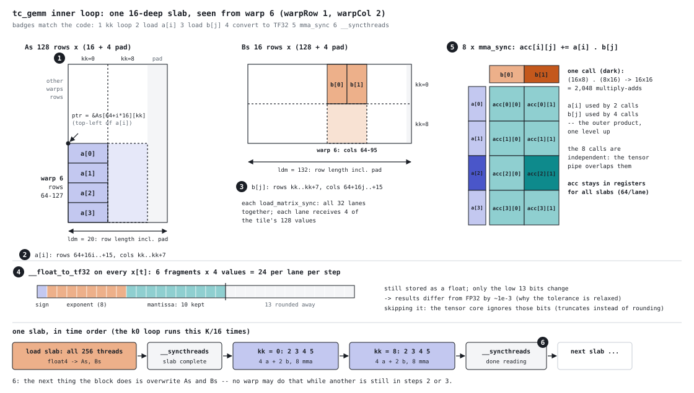

```
4096³                  time (ms)     TFLOP/s   % cuBLAS FP32   % cuBLAS FP16
warptile (FP32)           13.376       10.28           85.0%               -
tc_gemm (FP16)             5.033       27.31          225.8%           81.3%
cuBLAS FP32               11.364       12.09          100.0%               -
cuBLAS TF32                7.765       17.70          146.3%               -
cuBLAS FP16                4.090       33.60          277.8%          100.0%
```

Across the sweep shapes, as % of cuBLAS FP16: **79.1% (4096³), 85.4% (2048³),
86.5% (1024×4096×1024), 89.1% (8192×512×8192)**; 4000³ is skipped, because the
epilogue stores whole 16×16 fragments and needs rows and columns that are
multiples of 128. The comparison slightly favours cuBLAS: `tc_gemm` reads FP32
from global memory and converts on the fly, while the cuBLAS FP16 baseline
reads pre-converted FP16 — half the bytes.

**The first version was TF32, and it was slower than the FP32 ladder.** At 39%
of cuBLAS TF32 and 1.5× slower than `warptile`, it was taken apart by switching
pieces off (4096³, idle GPU):

| variant | time | % of the 25 TFLOP/s ceiling |
|---|---|---|
| full TF32 kernel | 14.6 ms | 37% |
| without global loads | 13.2 ms | 42% |
| **only the `mma`s** — no loads at all, 32 HMMA + a barrier per slab | **12.4 ms** | **44%** |
| only the memory side — no `mma` | 5.3 ms | — |
| cuBLAS TF32 | 6.3 ms | 87% |

Not memory: with every load removed the tensor pipe still ran at 44% — 16 warps
per SM, and only 32 tensor instructions between barriers, is not enough work in
flight for its latency. And the ceiling was the same as FP32's anyway. FP16
fixed both: twice the ceiling, and twice the math per barrier with BK = 32.

**One register over the line.** The FP16 version first compiled to 129
registers — which rounds up to 136 per thread, so only one 256-thread block fit
per SM instead of two. `__launch_bounds__(256, 2)` tells the compiler the target,
and it produced 126 registers with 0 spills. The SASS has the same instructions
(519 vs 520: one extra `MOV`, two fewer `NOP`) in a different order — the
compiler doesn't model occupancy unless told, so 129 was a side effect of its
schedule, not a need. (Compare Part 1, where the same bound forced 16 bytes of
spills and cost 8%.)

## tc_attn: FP16 fused attention

`tensor_core/tc_attn.cu` is `online_attn.cu` with the two products moved onto
tensor cores. The key observation: in the FP32 kernel, warp `w` already owns
query rows `w*16 .. +15` — exactly one 16-row fragment strip. So the thread
mapping, the softmax, the shuffles, `m`, `l` and the masking are **unchanged**;
only S, P·V and where S and O live change:

- **S = Q·Kᵀ:** 8 `mma_sync` per warp per chunk; stored to a shared `Ss` strip;
  each lane reads back exactly the 4×4 it used to compute itself.
- **Kᵀ for free:** K is stored in its natural layout and loaded as a
  `col_major` fragment, which *is* Kᵀ — no transposed store, and none of its
  bank conflicts.

  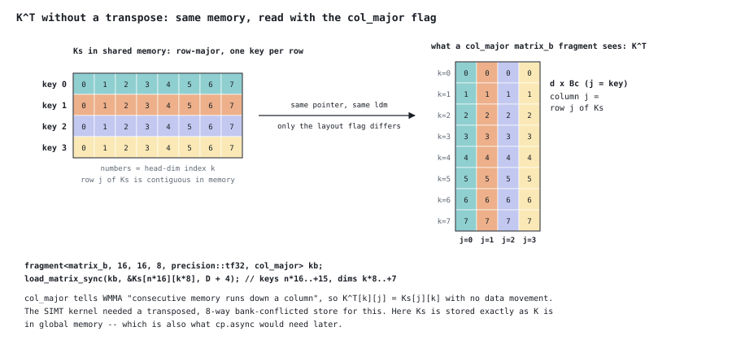

- **Q once:** each warp's Q rows are loaded into 4 fragments before the chunk
  loop and stay in registers for the whole kernel.
- **O in shared:** the `alpha` rescale is per row, which a fragment can't do, so
  the O accumulator lives in a shared `Os`: rescaled by the softmax lanes, loaded
  as an accumulator, updated by 8 `mma_sync`, stored back — every chunk.
- **P as half, over Ss:** P is written as `half` into the memory S came from;
  the barrier that used to protect the P-over-K alias now protects P-over-S.

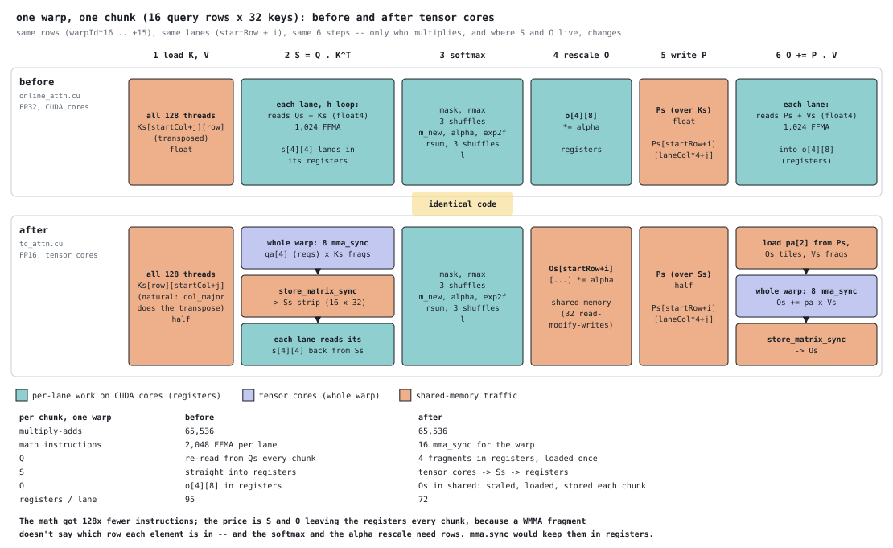

```
     N    online (FP32)    tc-fp16    speedup     tc-fp16 TFLOP/s
  1024          0.11 ms       0.07       1.6x                4.1
  2048          0.23          0.13       1.8x                8.0
  4096          0.71          0.37       1.9x               11.5
  8192          2.92          1.53       1.9x               11.2
 16384         11.48          6.48       1.8x               10.6
 32768         43.26         24.37       1.8x               11.3
 65536        160.09         93.77       1.7x               11.7
```
*batch 1, d = 64, idle GPU; zero workspace at every N; error 3–4e-4 vs the CPU
FP64 reference (FP32 version: 1e-6).*

**Where it stops:** 11–12 TFLOP/s is about a quarter of the FP16 ceiling. Two
limits, both from WMMA hiding the fragment layout: S and O make a round trip
through shared memory every chunk, and the 17 KB FP32 `Os` makes shared memory
the occupancy limit (45 KB → 8 warps per SM, with 72 registers to spare). The
`mma.sync` route, with a documented register layout, keeps S and O in registers
like the FP32 kernel did.

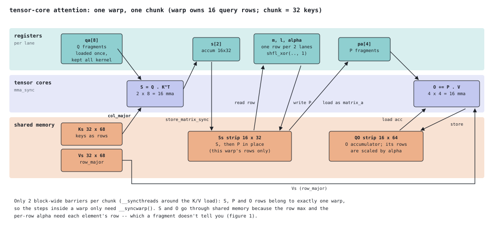

## Correctness (tensor cores)

- **Tolerance by precision.** Each kernel in the harnesses declares its input
  precision; TF32/FP16 kernels are judged at 1e-2 and their actual error is
  printed next to "ok", so the looser bound never hides a number. `tc_gemm`
  measures 6e-5–1.6e-4 against FP32 cuBLAS — the same as cuBLAS FP16 itself
  (7.6e-5).
- **Baselines at matching precision, and proven to be.** cuBLAS TF32
  (`CUBLAS_TF32_TENSOR_OP_MATH`) and cuBLAS FP16 (`cublasGemmEx` on FP16 copies
  made once, not timed) are self-tested against FP32 cuBLAS: a difference of
  ~1e-7 would mean the "low-precision" baseline was secretly running FP32.
- **The staged attention tests apply unchanged.** `make online-tc` runs the same
  V = 1 / Q = 0 / random stages and tile maps on `tc_attn`: 39 cases including
  N = 1, 31, 33, 100, 333 and 1000.
- **Alignment is the new failure mode.** The first FP16 GEMM kept TF32's 4-float
  padding: `ldm` became 36 halves instead of a multiple of 8, and the result was
  a sticky `misaligned address` on the first shape it ran.

---

## Measuring on a laptop

This GPU is power- and thermally-limited: `nvidia-smi` shows SW power capping
and SW thermal slowdown active for most of the session, and the SM clock moves
between 1.1 and 3.1 GHz on a time scale of tens of milliseconds — the same
scale as one kernel launch. The first timing method (one burst of iterations
per kernel, in a fixed order) produced spreads of 20–37% and once reported
warptiling as both +11% and 0% on consecutive runs.

What the harness does now, and why each piece exists:

| step | fixes |
|---|---|
| 2.5 s of sustained load before timing | the governor ramps at the start of a run and settles over ~1–2 s; time the steady state |
| every kernel launched once per round, 9 rounds, **median** reported | drift lands on all kernels equally instead of on whichever ran last |
| short kernels batched so each sample is ~20 ms | a 1.5 ms launch is at the mercy of one clock transition; at 2048³ this took spreads from 39% to 2–9% |
| `spread` column = (max−min)/median | says when a difference is inside the noise |

Spreads are now 2–10%. Locking the clock with `nvidia-smi -lgc` would do
better, but needs admin and may be refused on GeForce laptop parts. Small
effects (< 5%) were resolved with a separate paired A/B: alternating launches,
order swapped each pair, per-pair ratio, 40 pairs.

## Build and run

Needs `nvcc` (CUDA 13.3 here) and cuBLAS. Built for `sm_120`; change `ARCH`
in the Makefile for another card.

```bash
make test     # SGEMM correctness suite, 8 shapes x 9 kernels
make bench    # SGEMM correctness + performance table at 4096^3
make sweep    # SGEMM performance at 5 shapes + summary table
make regs     # registers, spills and shared memory per SGEMM kernel (-Xptxas -v)

make softmax     # softmax.cu unit test
make attn        # attention correctness suite (10 shapes x 3 variants)
make attn-bench  # attention correctness + sweep over N
make attn-sweep  # attention sweep only, N = 1024 ... 65536
make online      # staged debugging harness for the fused kernel
make online-tc   # the same staged tests on the FP16 tensor-core kernel
make peak        # peak TFLOP/s per format: FP32, TF32, FP16, FP8
```

or directly:

```bash
./build/test_sgemm 2048            # perf at 2048^3
./build/test_sgemm 1024 4096 1024  # perf at N=1024 K=4096 M=1024
./build/test_attn 8192             # attention perf at N=8192
./build/test_attn --d=128 --batch=8 --sweep
./build/test_online --map          # tile map for every failing case
```

Run everything from the repo root; binaries go to `build/` (`make all` builds
them all, `make clean` removes the folder). The harnesses `#include` the kernel
files, so **any kernel edit needs a rebuild** — always go through `make`, which
tracks them. Each file in `ladder/` also compiles on its own, with its own
`main`.

## Files

```
ladder/                     Part 1: one file per rung, each standalone
  naive.cu … warptiling.cu    the nine SGEMM kernels
  tilecheck.py                CPU check for load mappings: coverage and coalescing
attention/                  Part 2
  gemm.cuh                    the warptiling SGEMM as a reusable header (namespace gemm)
  softmax.cu                  row softmax, one block per row, two-level shuffle reductions
  naive_attn.cu               unfused attention: transpose, gemm, softmax, gemm
  online_attn.cu              the fused kernel
tensor_core/                Part 3
  tc_gemm.cu                  FP16 WMMA GEMM (FP32 in/out, converted on load)
  tc_attn.cu                  FP16 WMMA fused attention
  mma_peak.cu                 peak throughput per number format
test/                       harnesses; each #includes the kernels it tests
  test_sgemm.cu               SGEMM correctness + timing, all rungs + tc_gemm vs cuBLAS FP32/TF32/FP16
  test_softmax.cu             softmax unit test
  test_attn.cu                attention correctness + sweep, all variants incl. tc-fp16
  test_online.cu              staged debugging harness for the fused kernels (--tc for FP16)
docs/                       figures: fig1-8 (SGEMM, regenerated by gen_fig.py), attn_fig* (attention), tc_fig* (tensor cores)
build/                      binaries, created by make (git-ignored)
Makefile                    all targets; run from the repo root
```

Convention: row-major fp32; the harness passes `(N, K, M)` = (rows of A,
inner dim, cols of B). The kernels name the same three `(M, K, N)`.

## What's not here

- **`mma.sync` + `ldmatrix`, and `cp.async`.** The tensor-core GEMM uses WMMA,
  whose fragment loads compile to generic `LD` (not `LDS`) and give no control of
  the register layout; cuBLAS FP16 is 11–21% ahead across the sweep. The next rung is PTX `mma.sync`
  fed by `ldmatrix`, with a multi-stage `cp.async` pipeline.
- **Split-K** for shapes that don't fill the machine (the 64-block column).
- **A scalar fallback dispatch** for K or N not divisible by 4. The kernel to
  fall back to exists (`sharedthreadtilev2`); the three-line wrapper doesn't.
- **Profiler data.** Nsight Compute is installed but refused hardware counters
  on this machine (`ERR_NVGPUCTRPERM`, a driver-side permission). Every claim
  about bank conflicts and shared-memory wavefronts above is from arithmetic,
  SASS inspection and A/B timing, not counters. The open question — why
  warptiling delivered 3% rather than 10% — is the first thing I'd put in front
  of `ncu`.

For the fused attention kernel, in rough order of value:

- **Batch × heads in the grid.** The launcher loops over the batch on the host;
  putting batch and heads in `blockIdx.y` fixes the small-N underutilisation
  for realistic shapes. Minutes of work.
- **Causal masking**, which every decoder LLM needs and which skips roughly half
  the chunks.
- **Other head dims.** d = 128 (LLaMA-class) needs a template instantiation with
  a smaller Br or Bc to fit registers and shared memory.
- **Pipelining the K/V loads** — register prefetch, or `cp.async` double
  buffering. `cp.async` can't transpose, so it also means storing K untransposed
  with a strided key-to-lane mapping, and it costs back the third block per SM.
- **`mma.sync` attention.** The FP16 WMMA kernel sends S and O through shared
  memory every chunk. With `mma.sync`'s documented layouts, S's accumulator
  becomes P's A-operand in registers and O is rescaled in place — the
  FlashAttention-2 design, and what would make a comparison with it meaningful.
- **An FP16 unfused baseline for attention.** `cublas-naive` is FP32, so the
  tensor-core kernel's lead over it mixes fusion with precision; cuBLAS FP16
  GEMMs around the same softmax would isolate the fusion gain.
- **FP8.** Measured at ~4× the FP32 ceiling on this GPU, but it needs
  `mma.sync` and per-tensor/per-block scaling.
- **Backward pass**, and split-KV (FlashDecoding) for long-context,
  single-query decoding.

## Reference

The SGEMM rung sequence follows the widely-cited ladder in
[Simon Boehm's "How to Optimize a CUDA Matmul Kernel"](https://siboehm.com/articles/22/CUDA-MMM),
whose measured percentages on an A6000 this project tracks closely up to the
warptiling step. The fused attention kernel implements the forward pass of
FlashAttention ([Dao et al., 2022](https://arxiv.org/abs/2205.14135)) with the
FlashAttention-2 split of query rows across warps
([Dao, 2023](https://arxiv.org/abs/2307.08691)), on CUDA cores in fp32 rather
than tensor cores. Everything here was written and measured independently on
the hardware described above.
